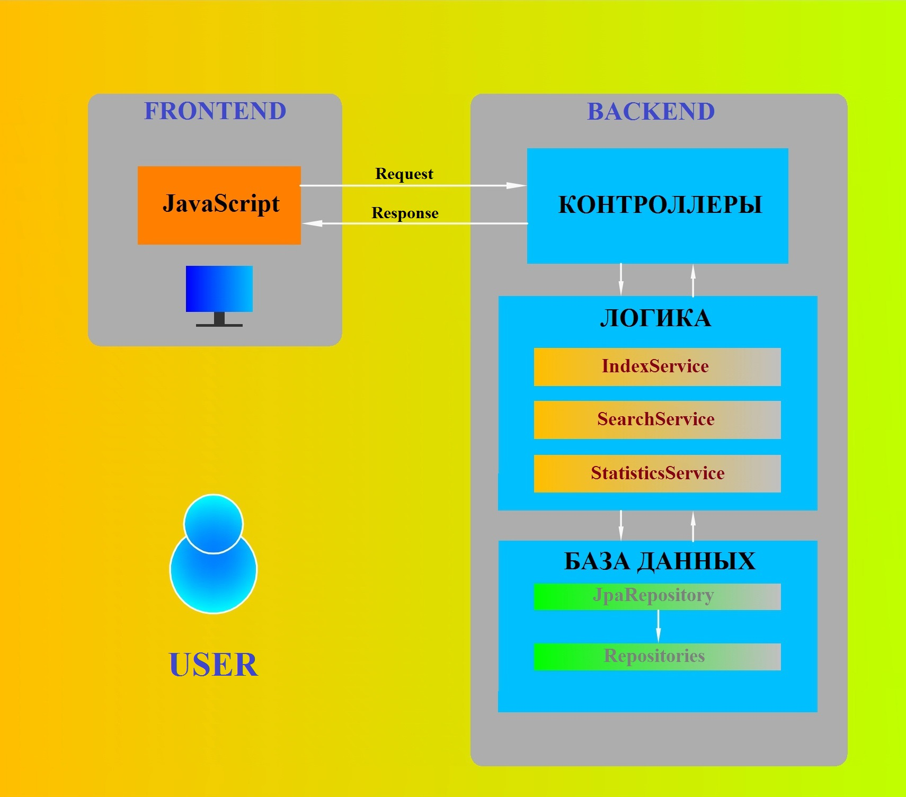
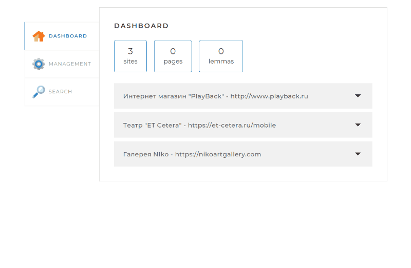

<p>
<h1  align ="center"  >ИТОГОВАЯ РАБОТА ПО КУРСУ "JAVA-РАЗРАБОТЧИК С НУЛЯ "ПОИСКОВЫЙ ДВИЖОК" </h1>
</p>

<p align="center">
  

</p>


___
<a id="8"></a>
## Содержание
* ### [Описание проекта](#7)
  * [Введение](#6)
  * [Структура проекта](#4)
  * [Описание классов, используемые в проекте](#5)
* ### [Стэк используемых технологий](#2)
* ### [Последовательность действий и демонстрация работы проекта](#1)
  * [Индексация сайтов](#10)
  * [Выполнение поискового запроса](#11) 


___
<a id="7"></a>
## __Описание проекта__
<a id="6"></a>
### __Введение__

Настоящий проект является итоговой, заключительной работой курса Java-разработчик с  нуля. Основной целью проекта явилось создание поискового движка - приложения, которое позволяет выполнять  поисковые запросы по заданным сайтам, отоброжать их в определенной форме. Для этого приложение должно предварительно выполнять индексацию страниц для осущестления по ним быстрого поиска.
Имена сайтов, по которым производится поиск, а также параметры взаимодействия с базой MyQSL, определены в конфигурационном файле ___application.yaml___ 
___
Файл __application.yaml__


```yaml
spring:
  datasource:
    username: root
    password: root
    url: jdbc:mysql://localhost:3306/search_engine?useSSL=false&requireSSL=false&allowPublicKeyRetrieval=true
  jpa:
    properties:
      hibernate:
        dialect: org.hibernate.dialect.MySQL8Dialect
    hibernate:
      ddl-auto: update
    show-sql: true

indexing-settings:
  sites:
    - url: http://www.playback.ru
      name: Интернет магазин "PlayBack"
    - url: https://et-cetera.ru/mobile
      name: Театр "ET Cetera"
    - url: https://nikoartgallery.com
      name: Галерея NIko
```
Поисковый движок предствляет из себя  Spring-приложение, запускаемое на любом сервере или компьютере, работающее с локально установленной базой MyQSL, через которую можно управлять и получать результаты поисковой выдачи по запросу.
___

<a id="4"></a>
## __Структура проекта__

Проект состоит из двух составляющих: Fromtend и Backend. В рамках данного проекта Frontend составляющая, написанная на JavaSript, не разрабатывалась. Основной темой разработки явилась Backend составляющая, написанная на языке java. 
### Блок-схема проекта



___
<a id="5"></a>
## __Описание классов используемых в проекте__

Все классы, используемые в проекте находятся в папке __src/main/java/searchengine__, что является необходимым для сборки и запуска приложения с помощью Maven.
* __Контроллеры__ принимают от Frontend,  (возвращают в Frontend) ruquest(response)запросы и передают в (получают из) service для  обработки запросов. Контроллеры работают по стандарту REST и соответсвенно возвращают ответы в формате JSON.
   * DefaultController - автоматически подключает и возвращает код веб-страницы index.html;
   * ApiController - формирует запрос statistics, передает его в сервис statisticsService и, получив от него результат отработки, передает его в Backend для отображения статистики работы программы в вэб-интерфейсе.
   * IndexController - API контроллер, принимающий (передающий) API запросы от (в) FRONTEND и передающий (принимающий)  в (из) IndexService.
   * SearchController - API контроллер, принимающий (передающий) API запросы от (в) FRONTEND и передающий (принимающий)  в (из) SearchService.
  
Связь контроллеров и логики осущестляется при помощи интерфейсов Index.Servise, SearchService и StatisticsService. 
* __Логика__ содержит в себе основные сервисы, предназначенные для выполнения запросов, поступающих от контроллеров. Результаты выполнения работы логики передаются в контроллеры и базу данных.
  * _IndexService_ - класс, содержащий логигу выполнения индексации сайтов по запросам через интерфейс IndexService от IndexController. Для выполнения запросов указанный класс использует также  коды классов PageUrlFound, IndexSite, IndexPage, LuceneMorfology, lemmaWriter, а таже взаимодейтсвут с базой данных;
  * _SearchService_ - класс,  реализующий логику получения  результатов поиска по сайтам, используя для этого запросы к базе данных. Класс для своей работы использует функционал классов LuceneMorfologe, SnippetCreator, а также взаимрдействует с базой данных.
  * _StatisticsService_ - класс, реализующий логику получения информации, содержащиеся в базе даннных.
* __База данных__ является реаляционной базой MyQSL и построена на основе четерех классов, данные (поля) которых отображены в соответствующих таблицах:
   * _Site_, содержащей данные индексируемого сайта;
   * _Page_, содержащий данные конкретной страницы сайта;
   * _Lemma_, содержащий данные леммы индексируемого сайта;
   * _Index_, содержащий данные леммы конкретной страницы ссайта 


##### __Таблица Site__

|id  | last_error | name             | status |url|
|:---: |:----------:|:--------------:  |:------: |:---:|
|1   | NONE       | Интернет магазин "PlayBack" |INDEXED | http://www.playback.ru   
|2   | NONE       | Театр "ET Cetera |INDEXED |https://et-cetera.ru/mobile |
|3   | NONE       | Галерея "NIKO" | INDEXED  |  https://nikoartgallery.com  

   
##### __Таблица Page__


|id | code | content | path | site_id |
|:---:|:---:|:---:|:---:|:---:|
|...|...|...|...|...|
|2|200|<html> <head> <meta http-equiv="content-type...> | /performance/grekh-da-beda-na-kogo-ne-zhivet/ | 2
|...|...|...|...|...|


##### __Таблица Lemma__

|id | frequency| lemma | site_id |
|:---:|:---:|:---:|:----:|
|...|...|...|...|
|1602|5|брусникин|2|

##### __Таблица Index__

|id|ranks|lemma_id|page_id
|:---:|:---:|:---:|:---|
|...|...|...|...|
|1336|3|1602|2|
|2454|1|1602|23|
|2729|1|1602|24|
|2841|1|1602|25|
|8925|2|1602|51|

Для организации взаимаодействия логики с базой данных в данном проекте используются возможности JPA репозитория, которые  наследуются классами SiteRepository, PageRepository, Lemmarepository, IndexRepository. 
___
<a id="2"></a>
## __Стэк используемых технологий__
Непосредственно в проекте используются следующие технологии:
  * __Spring Boot__ как составная часть Spring Framework является основой всего проекта;
    * шаблонизатор __Thymeleaf__;
    * библиотека __Lombok__.
 *  Классы __ExecutorService__, __Runnable__ - для создания многопоточности. Используется в классе IndexService для написания многопоточного приложения - запуска индексации сайтов;
 *  __ForkJoinPool__ Framework служит для эффективного распаралеливания выполнения задач, используя рекурсивные алгоритмы. Тенология используется в классе IndexSite, PageUrlFound для построения логики обхода сайта и поиска всех внутренних ссылок;
 *  Библиотека __jsoup__ служит для парсинга (разбора) HTML-страниц в целях извлечения необходимых данных - (hmml контента, определенных тегов и пр.). Используются в классах PageUrlFound;
 *  Библиотека __RussionLuceneMorphology__ служит для создания из слова набора лемм (единой формы, к которой приводится слово, например, в том числе, к именительному падежу, единственному числу), а также для определения части речи (подлежащее, предлог, частица). Применяется в классe LuceneMorfology; 
 *  __Hibernate__ Framework служит для связи сервисов логики с реляционной базой данной MySQL. При этом база данных представляет собой набор связанных определенным образов объектов (Site, Page, Lemma, Index). База данных и связи между таблицами создаются средствами hibernate  в процессе запуска программы;
 *  Язык __SQL__ запросов служит для обмена информацией сервисами логики с базой данных;
 *  Коллекции __ArrayList__, __HashMap__, массивы __Array[]__  для хранения и изменения  различных java-объектов в оперативной памяти. 
___     
<a id="1"></a>
## __Последовательность действий и демонстрация работы проекта__
Проект запускается методом main из класса Application, помеченного аннотацией @SpringBootApplication. После запуска (длится некоторое время), при отсутствии ошибок наберите в адресной строке открытого браузера http://localhost:8080/. При этом загрузится первая вкладка рабочего интерфейса. Если приложение запускается впервые в графах __pages__ и __lemmas__ отобразятся нули, что свидетельствует об отсутствии  данных в базе и необходимости запустить индексацию сайтов.

 <a id="10"></a>
## Индексация сайта
 * Переходим во вторую вкладку, нажав кнопку  "MANAGEMENT", после чего нажимаем кнопку "START INDEXING". При этом запускается процесс индексации сайтов в сответствии с перечнем сайтов, написанном в конфигурационном файле application.yaml. Если запустить индексацию при наличии информации в базе данных то сначала будут очищены все записи в базе данных, после чего приложение запустит индексацию. 
 * Дождаться завершения процесса индексации. Процесс может занимать значительное время, до нескольких часов в зависимости от системных свойств компьютера и качества интернет-соединения. При этом можно контролировать работу программы, периодически обновляя страницу. В результате значения в графах "pages" и "lemmas" будут изменяться. Индексация считается завершенной при наличии включенной зеленой кнопки  "INDEXED".
 * Если требуется выполнить индексацию отдельной html-страницы, из  сайтов, перечисленных в конфигурационном файле application.yaml, необходимо войти во вторую вкладку и вбить html-адрес в графу "Add/update page" после чего нажать кнопку "ADD/UPDATE"

### Демонстрация процесса индексации
 
<a id="11"></a>
## Выполнение поискового запроса
* Проверить, что все сайты проиндексированы, для чего обновить страницу и убедиться, что статус индексации соответствует символу "INDEXED" (зеленая кнопка)
* Перейти в третью вкладку, нажав кнопку "SEARCH"
* Вбить в графу "Query" строку запроса, после чего нажать кнопку "SEARCH"
* Результаты запроса - количество найденных результатов, адреса страниц, сниппеты - отбразятся в поле "SEARCH" в нижней части
### Демонстрация поискового запроса
  

Результат ответа LinkThreadController (запрос -Режиссер Александр Морфов) в формате json
```json
 {"result":true,
 "data":[
  {"site":"https://et-cetera.ru/mobile",
 "siteName":"Театр «Et Cetera»",
 "uri":"/performance/dekameron-ili-lyubov-vo-vremya-chumy/",
 "title":" Декамерон  Любовь во время чумы ",
 "snippet":"<p>Много лет назад <b>режиссер Александр Морфов</b> поставил спектакль по одной из великих книг человечества - «Дон Кихоту» Мигеля де Сервантеса. Это был блистательный спектакль, в котором <b>режиссер</b> сформулировал философию «донкихотства», показал, как из реальности рождается миф. Прошло почти 20 лет и <b>Александр Морфов</b> вновь обратился к великому тексту, теперь к шедевру Итальянского Возрождения - «Декамерону» Джованни Боккаччо.&nbsp;</p>",
 "relevance":1.0}
 ],
 "count":1,
 "error":null}
  ```
  ___
  [В содержание](#8)
   


